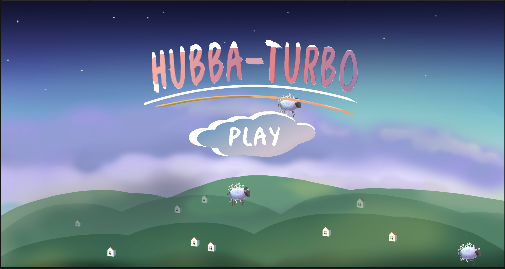
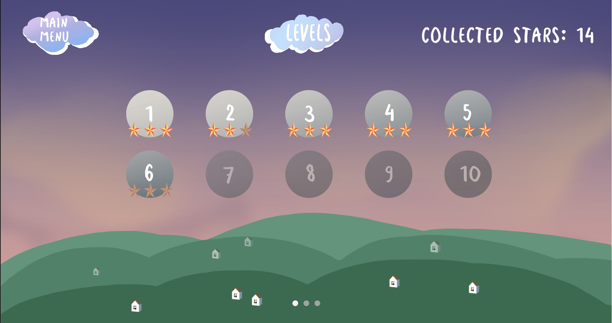
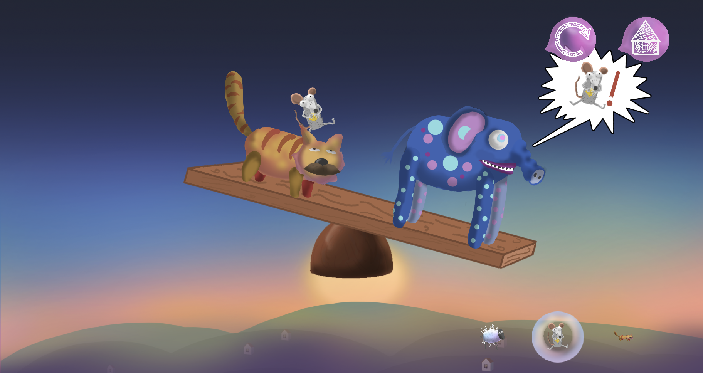
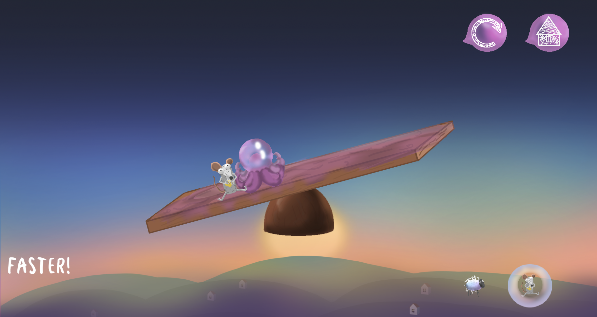

# Hubba-Turbo
The mobile game, where the player needs to balance the desk, using plasticine animals. The game goes step by step - the player creating an animal on the left side of the screen and then the computer responding on the right side. After the weight is equalized, the table is automatically set to the default position, the player wins. Below some aspects of the game will be discussed in more detail.

Image 1 - Example of balance
## Starting game
To get started, you need to start an _Intro_ scene, although the game will work correctly if you start with scenes from the _Menu_, _StartScreen_, or _Zones_. You can even start the game directly from the level scenes in the _Zone 1_ folder, however, be careful when completing closed levels - __this can cause errors in the progression system__. __Don't run an interface scene__ - it should only work in conjunction with level scenes.
## Progress system
Each level contains three stars - an indicator of the degree of completion.
- __1 star__ - the player has completed level
- __2 stars__ - the player did not let the animals fall or finished the level in 10 seconds
- __3 stars__ - the player did not let the animals fall and finished the level in 10 seconds

After the level has been completed, information about its passage is saved to a binary file, the next level will be opened. If you want to reset all progress, in the _Menu_ scene find gameobject _MenuInfo_ and in the _Menu_ script, check the box next to _IsClearData_. __Do not forget to uncheck the box in the next game session__, otherwise the progress will be cleared again.

Image 2 - Player's progress

Image 3 - Clearing progress

## Creating levels
Starting from 14 levels are not filled with anything. You can create them yourself using resources from the project, without writing any code.
### Adding characters to interface
Find gameobject _InstantiateSettings_ at the level with the same script. In the _Inventory settings_ tab, you can insert the appropriate scriptable objects into the inventory items list. When you start a level, animals will appear in the inventory in the order you choose. To set the animal that will be selected initially, set it in enum _Start Item  For Instantiate_.

Image 4 - Setting inventory  
  
Image 5 - Result of setting inventory
### Adding characters to board
To set the starting items on the board, you can simply drag and drop the desired prefab onto the stage. However, if the starting character is on the player's side, you must check the _IsStartItem_ checkbox in the _Item_ script located on the character's prefab.

Image 6 - Setting starting character

To configure which animals the computer will summon, refer to the _InstantiateSettings_ script, _ComputerInstantiateSettings_ tab. The _Instantiate Items_ list determines which animals will be summoned, at what point, in what quantity and in what order.

Image 7 - Setting computer summons

## Mechanics
To keep the game from looking boring, various mechanics have been added to it, such as __fear__, __mines__, __meteorites__, __slippery board__. Each of them will be discussed in detail below.
### Fear
Certain types of animals may fear other characters and run away when they appear on the board. For example, a mouse is afraid of a cat. To find out the specific fear of a character, you need to go to his prefab (Resources/Prefabs/Items), to the escape script.

Image 8 - Mouse escaping from cat

Image 9 - Checking fear animal

###Mines
Mines explode after being touched by any character. In the prefab settings, you can set the explosion time, the delay before the explosion, as well as the weight of the bomb.

Image 10 - Mine on board

###Meteorites
Meteorites, unlike mines that only throw out animals, destroy them as soon as they touch. Meteorites fly along a given trajectory, which can be changed by changing the type of cyclical movement in the prefab(Assets/Resources/Prefabs/Movement). In addition, in the script, you can change the speed, radius, and center point of movement.

Image 11 - Meteor

Image 12 - Meteor's movement settings

###Slippery board
Once a special character (octopus) touches the board, it becomes covered with his slime, becoming slippery. The player needs to complete the level as quickly as possible until all the animals have slid down.

Image 13 - Slippery board
## Screenshots

  
  

  
  

